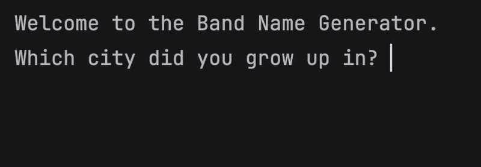

# Day 1 - Variables in Python to Manage Data

## Concepts Learned
- Printing to the Console in Python
- String Manipulation and Code Intelligence
- Debugging
- The Python Input Function
- Python Variables
- Variable Naming

## Band Name Generator
### A simple Python program that generates a band name based on user inputs using variables and string concatenation.

