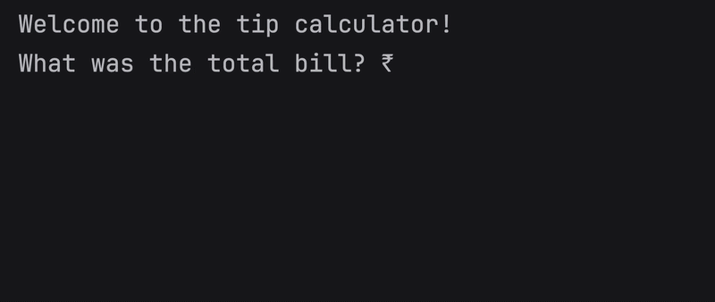

# Day 2 - Data Types and String Manipulation

## Concepts Learned
- Python Primitive Data Types
- Type Error, Type Checking and Type Conversion
- Data Types
- Mathematical Operations in Python
- Number Manipulation and F Strings in Python

## Tip Calculator
### A command-line calculator that splits a restaurant bill and tip among multiple people using Python arithmetic operations.

