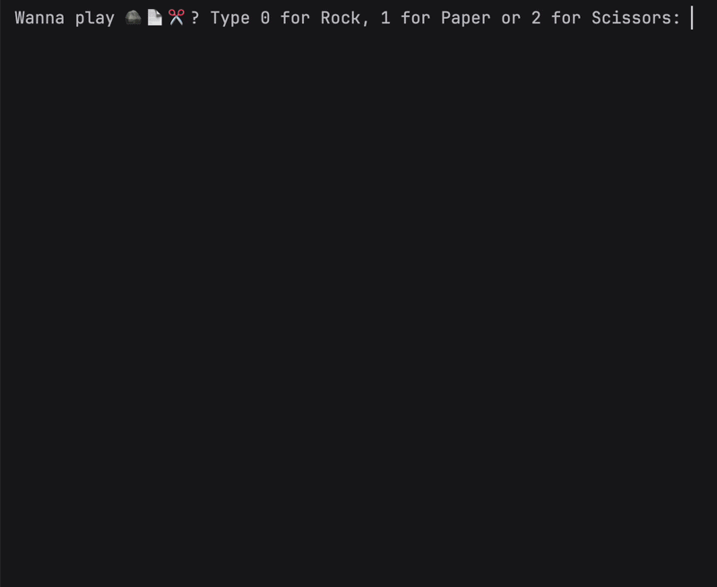

# Day 4 - Randomization and Python Lists 

## Concepts Learned
- Random Module
- Understanding the Offset and Appending Items to Lists
- Index Errors and Working with Nested Lists

## Rock Paper Scissors
### A command-line implementation of the classic Rock-Paper-Scissors game against the computer using randomization.

