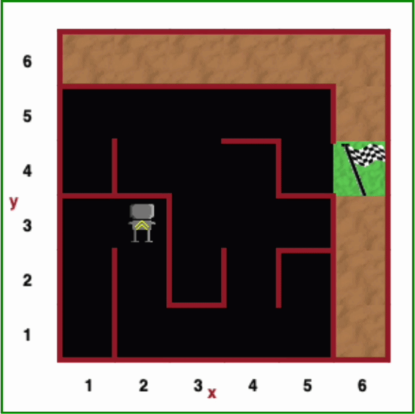

# Day 6 - Functions and Karel 

## Concepts Learned
- Defining and Calling Python Functions
- Indentation in Python
- While Loops

## Reeborg’s Maze Solver
### A maze-navigation program that guides a robot to the goal using loops, functions, and conditional logic.

This is where robot lives → [Robot's Home](https://reeborg.ca/reeborg.html?lang=en&mode=python&menu=worlds%2Fmenus%2Freeborg_intro_en.json&name=Maze&url=worlds%2Ftutorial_en%2Fmaze1.json)
