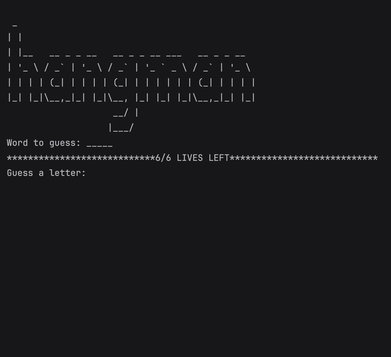

# Day 7 - Hangman Game 

## Concepts Learned
- How to break a Complex Problem down into a Flow Chart
- How to Check the User's Answer
- Improving the User Experience
-  How to Add ASCII Art and Improve the UI

## Hangman Game
### A console version of the Hangman word-guessing game using loops, lists, and conditional logic.

