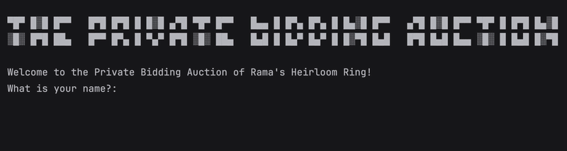

# Day 9 - Dictionaries, Nesting, and the Secret Auction 

## Concepts Learned
- The Python Dictionary
- Nesting Lists and Dictionaries

## Secret Auction Program
### A bidding system that determines the highest bidder in a silent auction using dictionaries and loops.

