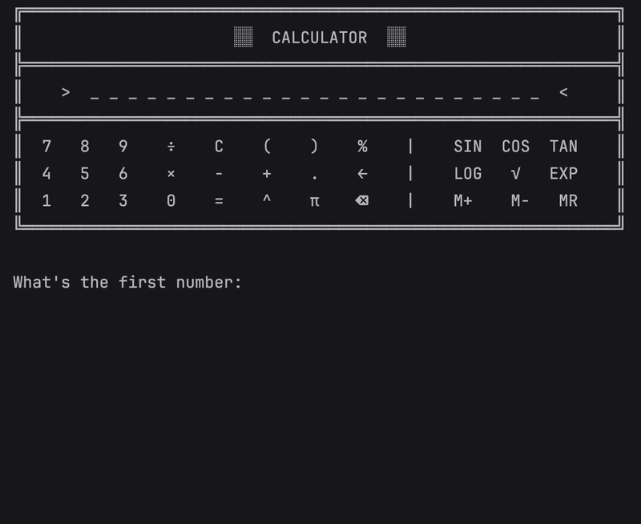

# Day 10 - Functions with Outputs

## Concepts Learned
- Function with Outputs
- Multiple return values
- Docstrings
- Combining Dictionaries and Functions
- Print vs Return
- While Loops, Flags and Recursion
  
## Calculator
### A command-line calculator that performs basic arithmetic operations using functions and user input.

- 

