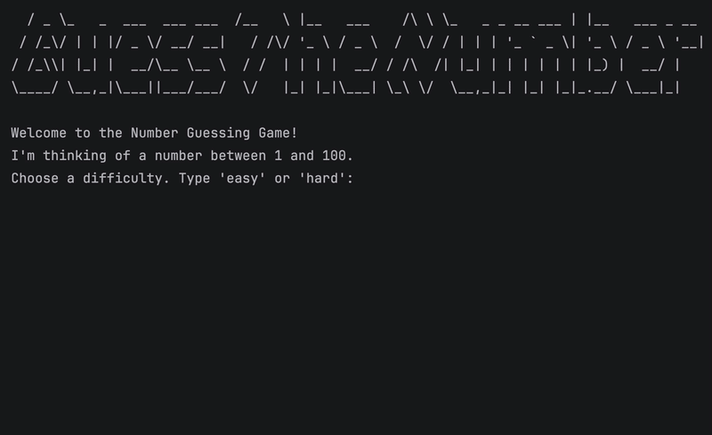
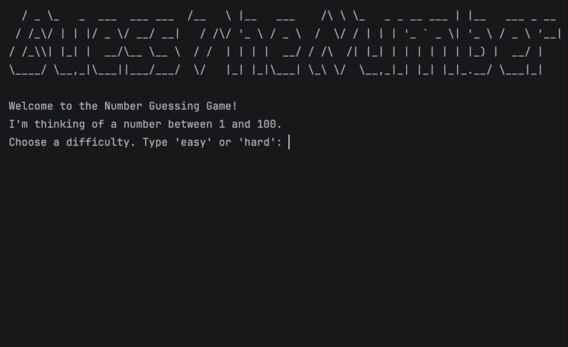

# Day 12 - Scope and Number Guessing Game

## Concepts Learned
- How to Modify a Global Variable
- Python Constants and Global Scope

## Number Guessing Game
### An interactive number-guessing game where the user attempts to find a randomly generated number within limited attempts.

