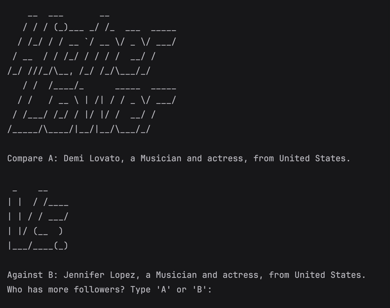

# Day 14 - Higher-Lower Game Project

## Concepts Learned
- Using Dictionary Data
- Using Procedures
- Using Conditional Statements
  
## Higher-Lower Game
A comparison game where players guess which celebrity or brand has more social media followers.

